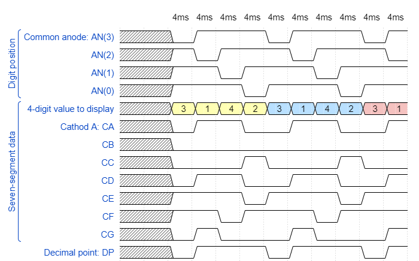

# 1. Lab 06-display-driver
### Preparation Tasks:
### Timing diagram figure for displaying valuse 3.142


# 2. Display
### Listing of BHDL code of the process p_mux with syntax highlighting :
```vhdl
p_mux : process(s_cnt, data0_i, data1_i, data2_i, data3_i, dp_i) 
begin
	case s_cnt is
		when "11" =>
			s_hex <= data3_i;
			dp_o  <= dp_i(3);
			dig_o <= "0111";

		when "10" =>
			s_hex <= data2_i;
			dp_o  <= dp_i(2);
			dig_o <= "1011";

		when "01" =>
			s_hex <= data1_i;
			dp_o  <= dp_i(1);
			dig_o <= "1101";

		when others =>
			s_hex <= data0_i;
			dp_o  <= dp_i(0);
			dig_o <= "1110";
	end case;
end process p_mux;

```
